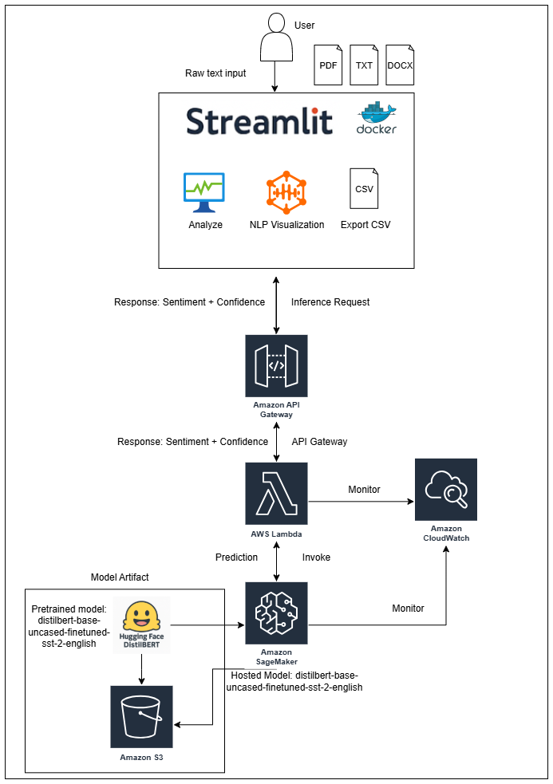

## 🧠 Serverless AI Sentiment Analysis with AWS SageMaker and Streamlit

A fully serverless NLP pipeline for real-time sentiment analysis using Hugging Face's DistilBERT model deployed on AWS SageMaker. The frontend is powered by Streamlit and supports document uploads, paragraph-level analysis, word clouds, heatmaps, and CSV export.

---

### 🔗 Live Demo

👉 Try it now: [https://cloud-computing-ai-inference.streamlit.app](https://cloud-computing-ai-inference.streamlit.app/)
*(Hosted on Streamlit Cloud, powered by AWS Lambda and SageMaker)*

---


### 📸 Features

* 🔁 **Serverless Architecture** using AWS Lambda, API Gateway, and SageMaker
* 🧠 **AI Model:** DistilBERT fine-tuned on SST-2 (binary sentiment)
* 📝 **Supports** plain text, paragraphs, PDFs, DOCX, and TXT files
* 📊 **Visualizations:** Sentiment heatmaps, word clouds
* 📁 **Exportable CSV** with sentence-wise sentiment
* ☁️ **CloudWatch Monitoring**
* 🐳 **Dockerized Streamlit App**

---

### 🚀 Architecture Overview



---

### 🛠️ Tech Stack

* **Model**: `distilbert-base-uncased-finetuned-sst-2-english`
* **Frontend**: [Streamlit](https://streamlit.io/)
* **Backend**: AWS Lambda (Python)
* **Model Serving**: AWS SageMaker
* **API**: AWS API Gateway
* **Monitoring**: AWS CloudWatch
* **Auth & Permissions**: AWS IAM
* **Packaging**: Docker

---

### 📦 Installation

#### Option 1: Run Locally

```bash
# Clone the repo
git clone https://github.com/wael-fahmy/sentiment-streamlit.git
cd sentiment-streamlit

# (Optional) Create a virtualenv
python -m venv venv
source venv/bin/activate  # Windows: venv\Scripts\activate

# Install dependencies
pip install -r requirements.txt

# Run the app
streamlit run app.py
```

---

#### Option 2: Run via Docker

```bash
# Build the image
docker build -t sentiment-app .

# Run the container
docker run -p 8501:8501 sentiment-app
```

Then open [http://localhost:8501](http://localhost:8501) in your browser.

---

### 📁 Project Structure

```
.
├── app.py                  # Streamlit frontend
├── lambda_function.py      # AWS Lambda handler
├── inference.py            # SageMaker inference script
├── requirements.txt
├── Dockerfile
├── model/                  # Exported Hugging Face model
├── utils/                  # Helper functions
├── docs/
│   └── architecture.png
└── README.md
```

---

### 🧪 How It Works

1. User submits a paragraph or document from the Streamlit UI.
2. The app sends the text to an AWS Lambda function via API Gateway.
3. Lambda forwards the text to a SageMaker endpoint running DistilBERT.
4. Sentiment results are returned and visualized with heatmaps and word clouds.
5. User can export results as a CSV.

---

### 📊 Example Output

| Sentence                              | Sentiment | Confidence |
| ------------------------------------- | --------- | ---------- |
| I love this app!                      | Positive  | 99.3%      |
| This is the worst decision ever made. | Negative  | 98.7%      |

---

### 🧱 Future Improvements

* Add multilingual support using XLM-RoBERTa
* Enable email reports via Amazon SES
* User login using AWS Cognito
* Semantic rewriting (e.g., convert negative to positive tone)
* Neutral state by using Multi-class Model cardiffnlp/twitter-roberta-base-sentiment

---

### 🧾 Citation

If you use this project, please cite:

```
@misc{fahmy2025serverless,
  title={Serverless AI Inference using AWS SageMaker and Streamlit},
  author={Wael Fahmy and Amirhossein Zeinali},
  year={2025},
  note={Cloud Computing Course Project, Lakehead University}
}
```

---

### 📬 Contact

For questions or feedback, please contact:

* Wael Fahmy: [wfahmy@lakeheadu.ca](mailto:wfahmy@lakeheadu.ca)
* Amirhossein Zeinali: [azeinali@lakeheadu.ca](mailto:azeinali@lakeheadu.ca)

